# Interview answers — mapped to this repo

Each answer below is the interview response. Directly after it is **where that idea lives in this codebase**: files + line numbers, a scoped directory tree, a step-by-step workflow, and a diagram.

**Legend:** *Implemented* = runs in this repo. *Conceptual* = interview-scale idea documented but not fully built (see `system_architecture.md`).

---

## Let's get started. How would you approach scaling a Python-based recommendations microservice to handle billions of users while ensuring low latency?

I’d approach it as a **distributed recommendation system**, not simply “make the Python service faster.” At billions of users, the key is to keep the **online request path extremely small** and push expensive recommendation work offline/asynchronously.

### 1. Start with the latency target

First define something like:

* **p50:** <20 ms
* **p95:** <50 ms
* **p99:** <100 ms
* Very high availability, e.g. 99.99%+

Then separate the system into:

```text
                    ┌───────────────┐
User ──────────────►│ API Gateway   │
                    └───────┬───────┘
                            │
                    ┌───────▼────────┐
                    │ Recommendation │
                    │   Service      │
                    │    Python      │
                    └───────┬────────┘
                            │
             ┌──────────────┼──────────────┐
             ▼              ▼              ▼
        Redis Cache    Candidate Store   Feature Store
             │              │              │
             └──────────────┼──────────────┘
                            ▼
                       Ranker / Model
```

### 2. Don't calculate recommendations synchronously

This is probably the most important architectural decision.

I would **precompute candidate recommendations** for users asynchronously.

For example:

```text
User activity
     │
     ▼
Kafka / Event Stream
     │
     ▼
Feature Processing
     │
     ├── User features
     ├── Item features
     └── Interaction features
             │
             ▼
      Recommendation Jobs
             │
             ▼
     Precomputed candidates
             │
             ▼
       Redis / KV Store
```

When the user makes a request, Python shouldn't run an expensive recommendation algorithm from scratch.

Instead:

```python
GET /recommendations/{user_id}

    ↓

Redis lookup

    ↓

candidate IDs

    ↓

lightweight ranking/filtering

    ↓

response
```

That turns a potentially 500 ms–2 second operation into something closer to tens of milliseconds.

---

### 3. Horizontal scaling of Python

I wouldn't try to make one gigantic Python process.

I'd make the recommendation API **stateless** and horizontally scalable:

```text
                    Load Balancer
                         │
          ┌──────────────┼──────────────┐
          ▼              ▼              ▼
      Python Pod     Python Pod     Python Pod
          │              │              │
          └──────────────┼──────────────┘
                         ▼
                    Redis / DB
```

Use:

* FastAPI
* async I/O where appropriate
* multiple workers
* Kubernetes/ECS/etc.
* autoscaling based on CPU, request rate and latency

The important thing is that **any instance can handle any request**.

---

### 4. Aggressive caching

At billions of users, hitting the primary database for every recommendation request isn't viable.

I'd use several levels of caching:

```text
L1 → process-local cache
L2 → Redis / distributed cache
L3 → recommendation store
L4 → database
```

For example:

```python
recommendations = redis.get(f"recommendations:{user_id}")

if recommendations:
    return recommendations

# fallback
recommendations = recommendation_store.get(user_id)
```

I'd also cache **popular/trending recommendations** separately because millions of users may request the same data.

---

### 5. Candidate generation + ranking

I would split recommendation into two stages:

```text
                    User
                     │
                     ▼
             Candidate Generation
                     │
              500–5000 items
                     │
                     ▼
                 Filtering
                     │
                100–500 items
                     │
                     ▼
                  Ranking
                     │
                     ▼
                Top 10–50
```

Candidate generation can use things like:

* collaborative filtering
* item-to-item similarity
* popularity
* user history
* content-based recommendations

Then the ranking model can be much more sophisticated because it only evaluates hundreds of candidates rather than millions/billions.

---

### 6. Keep ML inference out of the hot path where possible

For expensive models, I'd consider:

* precomputed embeddings/features
* model serving infrastructure
* batching
* quantized models
* ONNX/TensorRT where appropriate
* GPU inference only where it actually improves economics/latency

For example:

```text
Offline training
      │
      ▼
Model Registry
      │
      ▼
Model Deployment
      │
      ▼
Recommendation Workers
      │
      ▼
Precomputed recommendations
```

The API layer should primarily be **retrieval + lightweight ranking**.

---

### 7. Partition the data

At billions of users, data partitioning becomes critical.

I'd partition/shard based on something like:

```text
hash(user_id) → shard
```

rather than allowing a single database to become the bottleneck.

For example:

```text
Users
 │
 ├── Shard 1
 ├── Shard 2
 ├── Shard 3
 ├── ...
 └── Shard N
```

I'd choose the actual storage technology based on access patterns rather than automatically reaching for PostgreSQL.

PostgreSQL can remain useful for metadata/configuration, while high-volume recommendation retrieval could use a distributed KV/document store.

---

### 8. Event-driven architecture

User interactions should generate events:

```text
click
view
purchase
like
skip
search
```

into something like:

```text
Kafka
  │
  ├── Feature pipeline
  ├── Analytics
  ├── Model training
  ├── Real-time personalization
  └── Recommendation refresh
```

This prevents the recommendation API from becoming tightly coupled to every downstream operation.

---

### 9. Handle hot users and hot keys

One subtle problem at this scale is **hot keys**.

A celebrity, viral product, or trending video could cause millions of requests for the same recommendation key.

I'd use:

* replicated cache entries
* local caching
* request coalescing
* TTL jitter
* precomputed popular results
* CDN where applicable

For example, instead of 10,000 instances simultaneously missing the same cache entry:

```text
10,000 requests
       │
       ▼
single refresh
       │
       ▼
Redis
       │
       ▼
10,000 responses
```

---

### 10. Graceful degradation

At billions of users, something will eventually fail.

The service shouldn't return errors just because the ranking model or feature store is unavailable.

I'd define fallbacks:

```text
Personalized recommendations
          ↓ failure
Cached recommendations
          ↓ failure
Popular recommendations
          ↓ failure
Trending recommendations
          ↓ failure
Static/default recommendations
```

The user should still receive something useful.

---

### 11. Observability

I'd instrument the entire request path with:

* OpenTelemetry
* distributed tracing
* structured logging
* Prometheus metrics
* latency percentiles
* cache hit ratio
* recommendation freshness
* model inference latency
* error rates

I'd particularly monitor:

```text
p50
p95
p99
cache hit %
DB latency
model latency
queue lag
CPU/memory
requests/sec
```

At this scale, **p99 matters much more than average latency**.

---

### 12. My overall architecture

I'd probably end up with something along these lines:

```text
                         ┌──────────────┐
                         │ API Gateway  │
                         └──────┬───────┘
                                │
                         ┌──────▼───────┐
                         │ FastAPI      │
                         │ Stateless API│
                         └──────┬───────┘
                                │
             ┌──────────────────┼─────────────────┐
             │                  │                 │
             ▼                  ▼                 ▼
        Local Cache          Redis          Feature Store
             │                  │                 │
             └──────────────────┼─────────────────┘
                                ▼
                       Candidate Store
                                │
                                ▼
                         Lightweight Ranker
                                │
                                ▼
                           Top-N Results


       User Events
            │
            ▼
          Kafka
            │
      ┌─────┼─────────┐
      ▼     ▼         ▼
 Features  Analytics  ML Training
      │                 │
      ▼                 ▼
 Feature Store      Model Registry
      │                 │
      └───────┬─────────┘
              ▼
       Recommendation
          Workers
              │
              ▼
       Precomputed Results
```

**The core principle:** I would scale the **computation and data layer independently from the Python API**. FastAPI instances remain stateless and horizontally scalable, while recommendation generation, feature computation, model training, and candidate generation happen asynchronously. The online API then performs mostly **cache/KV retrieval + lightweight ranking**, which is what makes billions of users and low latency achievable.

If this were a **system-design interview**, I'd emphasize that distinction because saying *“I'll put FastAPI behind Kubernetes and add Redis”* isn't enough—the real scaling strategy is **precomputation, partitioning, caching, asynchronous pipelines, and a very thin online serving path**.

### Where this is implemented

**Idea in this repo:** keep `GET /recommendations/{user_id}` thin (Redis lookup + lightweight rank). Heavy work is async: Kafka → consumer → Postgres history + Redis features. Scale the API with Kubernetes replicas + HPA. Billion-user sharding/CDN/TTL-jitter remain conceptual.

#### Directory

```text
recommendation-service/
├── app/
│   ├── main.py                      # thin online path + cache + fallbacks
│   ├── recommendation_service.py    # features + candidates → model
│   ├── redis_client.py              # L2 Redis (timeouts)
│   ├── feature_store.py             # online features: features:user:{id}
│   ├── recommendation_repository.py # candidate generation (PG)
│   ├── recommendation_store.py      # persisted per-user results + popular
│   ├── model.py / model_registry.py # lightweight ranker v1/v2
│   ├── kafka_producer.py            # events keyed by user_id
│   ├── kafka_consumer.py            # async materialization
│   ├── metrics.py / tracing.py      # p50/p95-style latency + traces
│   └── config.py                    # TTL, timeouts, model/service version
├── k8s/
│   ├── deployment.yaml              # 3 replicas, resources, probes
│   ├── service.yaml                 # stable network name
│   └── hpa.yaml                     # CPU autoscaling 3–10
├── docker-compose.yml               # Redis, Postgres, Kafka, app, consumer
├── scripts/load_test.py             # RPS / avg / p95
└── tests/test_recommendations.py    # cache hit skips model
```

#### Files and lines

| Concept | File | Lines | What it does |
| --- | --- | --- | --- |
| Thin online path | `app/main.py` | 84–85, 299–516 | Cache key; Redis → model → PG store → popular |
| Cache TTL / Redis URL | `app/config.py` | 15–17 | `cache_ttl`, `redis_url`, `redis_timeout` |
| Redis client (timeouts) | `app/redis_client.py` | 11–16 | Fail-fast socket timeouts |
| Candidate generation | `app/recommendation_repository.py` | 31–50 | Top-N active items by score |
| Candidate seed | `app/seed.py` | 17–32 | Catalog scores for ranking |
| Online features | `app/feature_store.py` | 16–31, 56–80 | Redis features; defaults if missing |
| Ranking (not full ML) | `app/model.py` | 21–60 | v1 popularity; v2 + user features |
| Model lookup | `app/model_registry.py` | 7–17 | Versioned models |
| Orchestration | `app/recommendation_service.py` | 32–120 | Features + candidates → `predict()` |
| Event ingress | `app/main.py` | 226–254 | `POST /interactions` → Kafka |
| Partition key | `app/kafka_producer.py` | 112–121 | Avro publish, key=`user_id` |
| Async pipeline | `app/kafka_consumer.py` | 50–94 | PG history then Redis features |
| Topic partitions | `docker-compose.yml` | 40–41, 54–78 | 3 partitions + DLQ topic |
| Horizontal pods | `k8s/deployment.yaml` | 9–10, 39–46 | `replicas: 3` + CPU/memory |
| Autoscaling | `k8s/hpa.yaml` | 15–27 | min 3 / max 10 / CPU 50% |
| Load / p95 | `scripts/load_test.py` | 1–13 | RPS, avg, p95, errors |
| Latency metrics | `app/metrics.py` | 7–17 | Histogram buckets for API latency |
| Cache hit skips model | `tests/test_recommendations.py` | 183–202 | HIT returns without ranking |

**Conceptual here (not built):** L1 process-local cache, CDN, request coalescing, TTL jitter, user-id DB sharding, GPU/ONNX serving, multiple Kafka consumer groups A–D, Ingress/Prometheus/Grafana backends. Called out in `system_architecture.md` lines 19–46.

#### Workflow (step by step)

1. Client calls `GET /recommendations/{user_id}` (`app/main.py` 303–309).
2. FastAPI looks up `cache:recommendations:{user_id}` in Redis (331–353). On HIT, return immediately.
3. On MISS (and Redis still up): `generate_recommendations()` loads Redis features + Postgres candidates, then the in-process model ranks top 5 (`recommendation_service.py` 51–89).
4. Result is written back to Redis with TTL (`main.py` 388–398).
5. If model/Redis fail: read the Postgres `recommendations` table (`recommendation_store.py` 8–23). If that fails: return `POPULAR_RECOMMENDATIONS`.
6. Separately, user activity is published to Kafka (`POST /interactions`); the consumer writes `user_events` and materializes `features:user:*` so the next online request is still a cheap lookup + rank.

#### Workflow diagram

```text
User ──► FastAPI (stateless pods, HPA)
              │
              ├─► Redis cache HIT ──────────────────────► response
              │
              ├─► MISS: Feature Store (Redis) + Candidates (PG)
              │         └─► Model rank (v1/v2) ─► cache write ─► response
              │
              └─► fail: PG store ─► fail: popular fallback ─► response

User events ──► Kafka (user-interactions, key=user_id)
                    └─► consumer ─► PG user_events + Redis features
```

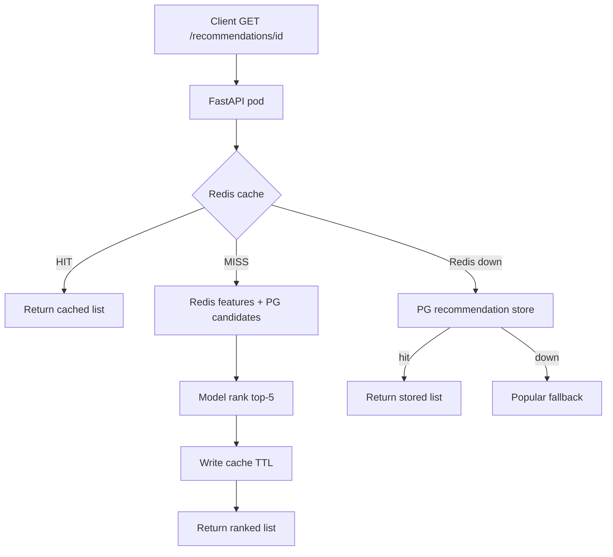

================================================================


## Recommendation service component, like the cache fails or the feature store. handle fault tolerance, cache fail or feature store unavailable
## How would you handle it?


Exactly. For the **Recommendation Service itself**, I’d design fault tolerance around the assumption that **every dependency can fail**.

### 1. Cache failure

I would treat Redis as an optimization, **not a hard dependency**.

```text
Request
   │
   ▼
Recommendation Service
   │
   ├── Redis ──► HIT ──► return
   │
   └── Redis unavailable
            │
            ▼
       Recommendation Store
            │
            ▼
       return fallback
```

If Redis is down:

* Don't let requests hang waiting for Redis.
* Use very short connection/read timeouts.
* Use a circuit breaker to stop repeatedly calling a failed Redis cluster.
* Fall back to the persistent recommendation store.
* If that also fails, return cached/stale data from local memory where possible.
* Finally fall back to popular/trending recommendations.

For example:

```python
try:
    recommendations = await redis.get(key)
except RedisError:
    recommendations = None

if not recommendations:
    recommendations = await recommendation_store.get(user_id)

if not recommendations:
    recommendations = await get_popular_recommendations()
```

The important principle is **stale recommendations are usually better than an error**.

---

### 2. Feature store unavailable

This is more interesting because it can affect personalization.

Suppose:

```text
Recommendation Request
        │
        ▼
   Feature Store ── X
        │
        ▼
  Ranking Model
```

I wouldn't make the feature store a single point of failure.

I'd maintain:

* **local/in-process recent features**
* Redis/distributed feature cache
* persistent feature store
* default feature values

So:

```text
Feature Store
     │
     X unavailable
     │
     ▼
Feature Cache
     │
     X unavailable
     │
     ▼
Default Features
```

The ranking model should be designed to tolerate missing features.

For example:

```python
features = await feature_cache.get(user_id)

if not features:
    features = DEFAULT_USER_FEATURES

recommendations = rank(candidates, features)
```

This allows the system to produce **less personalized recommendations rather than failing completely**.

---

### 3. Model/ranker failure

I'd apply the same principle.

```text
Candidate Generation
        │
        ▼
      Ranker
        │
        X
        │
        ▼
Popularity / heuristic ranking
```

For example:

```python
try:
    ranked = await ranker.rank(candidates, features)
except ModelUnavailable:
    ranked = rank_by_popularity(candidates)
```

---

### 4. Circuit breakers

I would put circuit breakers around dependencies such as:

```text
Redis
Feature Store
Model Service
Recommendation Store
External APIs
```

Instead of:

```text
Redis fails
 ↓
every request waits
 ↓
timeouts
 ↓
threads/tasks pile up
 ↓
Recommendation Service becomes overloaded
 ↓
cascading failure
```

The circuit breaker changes this to:

```text
Redis fails
 ↓
detect failures
 ↓
OPEN circuit
 ↓
stop calling Redis temporarily
 ↓
use fallback
 ↓
Redis recovers
 ↓
HALF-OPEN
 ↓
test request succeeds
 ↓
CLOSED
```

This prevents a dependency failure from becoming a **cascading failure**.

---

### 5. Timeouts are critical

I wouldn't allow a dependency to wait indefinitely.

For example:

```python
asyncio.wait_for(
    feature_store.get(user_id),
    timeout=0.02
)
```

If the feature store doesn't respond within 20 ms, move to the fallback.

At high scale, **timeouts are just as important as retries**.

And retries should be limited. Blindly retrying a failed dependency can actually make an outage worse.

---

### 6. Bulkheads

I'd also isolate resources.

For example, don't allow slow feature-store requests to consume every worker handling recommendation requests.

Conceptually:

```text
Recommendation Service
│
├── Feature Store connection pool
├── Redis connection pool
├── Model connection pool
└── DB connection pool
```

Each dependency gets controlled concurrency.

That way:

```text
Feature Store outage
       ↓
Feature requests exhausted
       ↓
BUT
       ↓
Recommendation API still has capacity
```

---

### 7. Graceful degradation hierarchy

This is probably the strongest answer to give in an interview:

```text
                    Personalized
                        │
                        ▼
                Cached personalized
                        │
                 cache unavailable
                        ▼
              Previously generated
                  recommendations
                        │
                 unavailable
                        ▼
                 Popular items
                        │
                 unavailable
                        ▼
                Trending items
                        │
                 unavailable
                        ▼
                Default results
```

So the API's contract becomes:

> **The recommendation service should continue returning useful recommendations even when personalization infrastructure is partially unavailable.**

---

### 8. What I'd say in an interview

A concise answer would be:

> "I would design the recommendation service assuming Redis, the feature store, and the ranking service can fail independently. Redis would be treated as a performance optimization rather than a hard dependency. I'd use aggressive timeouts, circuit breakers, bounded retries, and bulkheads around each dependency. If Redis fails, I'd fall back to the recommendation store or stale/local cached results. If the feature store is unavailable, I'd use cached or default features and degrade to a less personalized ranking. If the model service fails, I'd fall back to heuristic or popularity-based ranking. The key is graceful degradation—the service should return a slightly less personalized recommendation rather than turn a dependency failure into a user-facing outage."

### Where this is implemented

**Idea in this repo:** Redis is optional. Timeouts + a Redis circuit breaker fail fast. Features default when missing. Model/Redis failure falls through to the Postgres store, then popular items. Postgres pool size is a simple bulkhead. `/ready` stays ready as long as popular fallback exists.

#### Directory

```text
recommendation-service/
├── app/
│   ├── main.py                   # try/except chain; /ready reports deps
│   ├── recommendation_service.py # features via breaker; PG candidates retry
│   ├── feature_store.py          # default UserFeatures if Redis empty
│   ├── features.py               # click_count=0, purchase_count=0 defaults
│   ├── resilience.py             # CircuitBreaker, retry_async, timeouts helper
│   ├── redis_client.py           # socket_timeout / connect timeout
│   ├── database.py               # pool min_size=1, max_size=5 (bulkhead)
│   ├── config.py                 # circuit threshold, retry attempts
│   └── metrics.py                # redis/postgres failures, circuit opens
├── tests/
│   ├── test_resilience.py
│   └── test_recommendations.py
└── implementation_Readme_4.md    # resilience hardening write-up
```

#### Files and lines

| Concept | File | Lines | What it does |
| --- | --- | --- | --- |
| Redis not required | `app/main.py` | 331–378 | Cache get; `CircuitOpenError` / Exception → continue |
| Feature store via breaker | `app/recommendation_service.py` | 51–56 | `get_user_features` behind Redis breaker |
| Default features | `app/feature_store.py` | 23–31 | Empty Redis → `UserFeatures(user_id=...)` zeros |
| Feature defaults schema | `app/features.py` | 10–13 | `click_count=0`, `purchase_count=0`, `last_item_id=None` |
| Model path failure | `app/main.py` | 380–432 | Exception / circuit → skip personalization |
| PG store fallback | `app/main.py` | 434–480 | `get_recommendations()` from Postgres |
| Popular fallback | `app/main.py` | 491–501 | Always returns a list |
| Circuit breaker | `app/resilience.py` | 29–85, 139–154 | CLOSED → OPEN → HALF-OPEN |
| Redis breaker singleton | `app/resilience.py` | 157–172 | Shared by cache + feature reads |
| Retry + backoff | `app/resilience.py` | 106–136 | Transient errors only |
| Redis timeouts | `app/redis_client.py` | 11–16 | `socket_connect_timeout`, `socket_timeout` |
| Circuit / retry config | `app/config.py` | 50–57 | Threshold 3, recovery 30s, attempts |
| Connection pool bulkhead | `app/database.py` | 13–21 | `min_size=1`, `max_size=5` |
| Readiness without Redis | `app/main.py` | 120–166 | Reports Redis/PG/Kafka; requires only popular list |
| Soft Postgres init | `app/main.py` | 62–74 | Lifespan logs and continues if PG down |
| Tests: Redis fail → popular | `tests/test_recommendations.py` | 206–221 | Both Redis and PG down |
| Tests: model fail → PG | `tests/test_recommendations.py` | 225–239 | Store still used |
| Tests: breaker opens | `tests/test_resilience.py` | 71–116 | Fail-fast then popular |

**Not a separate feature-store service** in this repo: online features live in Redis; if Redis is down the *model path* is skipped (not “default features + rank” on that request). Default features apply when Redis is up but the user has no key yet.

#### Workflow (step by step)

1. Request hits `read_recommendations`. Redis cache is called through `call_with_circuit`.
2. If the breaker is OPEN, Redis is not called; `redis_available = False`.
3. If Redis is up: load features (defaults for new users) + candidates + `model.predict()`. On model/feature failure, drop to step 4.
4. Postgres `recommendations` table. On failure, step 5.
5. Return `[10, 20, 30, 40, 50]` (`POPULAR_RECOMMENDATIONS`) with `model_version="popular-fallback"`.
6. `/ready` still returns ready if that static list exists, even when Redis/Postgres/Kafka are down.

#### Workflow diagram

```text
Request
  │
  ├─ Redis cache (timeout + circuit)
  │     HIT → return
  │     OPEN / error → skip Redis
  │
  ├─ Features + model  (only if Redis still considered available)
  │     fail → next
  │
  ├─ Postgres recommendation store
  │     fail → next
  │
  └─ Popular / static list  → always 200 with useful IDs
```

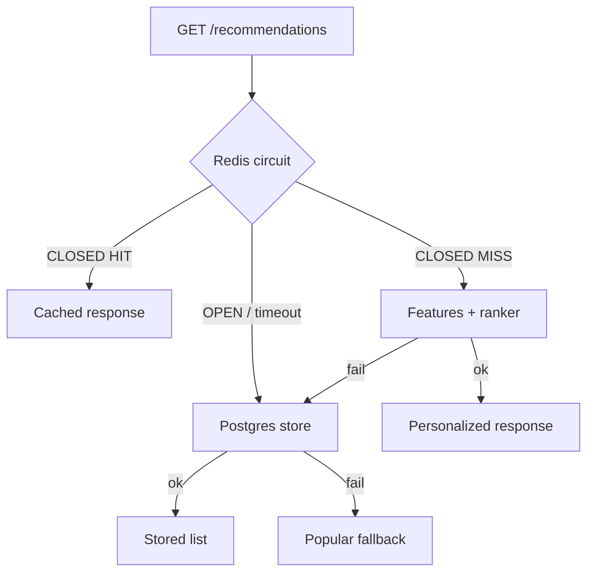

==================================================================


## fallabck for both to gracefully defrade the service if both the cache and ethe recommentdation are unavailable still maintaining the reasonable user experience, directly give me answer don't put examples and other stuff

I’d use a **multi-level graceful degradation strategy**. If both the cache and recommendation store are unavailable, the service should fall back to **popular/trending recommendations**, and if those are unavailable, return a **static/default recommendation set**. I’d also use **timeouts, circuit breakers, and bounded retries** so failed dependencies don’t cascade into the recommendation service.

This ensures the service continues responding with relevant content, even if personalization is temporarily unavailable, maintaining a reasonable user experience rather than returning an error.

### Where this is implemented

**Idea in this repo:** when Redis *and* the Postgres recommendation store are both down, `read_recommendations` still returns `POPULAR_RECOMMENDATIONS`. `/ready` is 200 if that list exists, 503 only if it does not.

#### Directory

```text
recommendation-service/
├── app/
│   ├── main.py                      # last rung of the fallback chain
│   ├── recommendation_store.py      # POPULAR_RECOMMENDATIONS = [10,20,30,40,50]
│   └── schemas.py                   # ReadyResponse.fallback
├── tests/test_recommendations.py    # dual-failure test
└── tests/test_resilience.py         # breaker + PG down → popular
```

#### Files and lines

| Concept | File | Lines | What it does |
| --- | --- | --- | --- |
| Popular list | `app/recommendation_store.py` | 5 | `[10, 20, 30, 40, 50]` |
| Dual-failure return | `app/main.py` | 482–501 | After PG except: popular + `popular-fallback` |
| Readiness uses fallback | `app/main.py` | 145–166 | `fallback_ok = bool(POPULAR_RECOMMENDATIONS)` |
| Ready schema | `app/schemas.py` | 27–33 | `fallback` field |
| Test both down | `tests/test_recommendations.py` | 206–221 | Broken Redis + boom pool → popular |
| Test breaker + PG down | `tests/test_resilience.py` | 88–116 | Circuit then still popular |

#### Workflow (step by step)

1. Cache lookup fails (Redis error or open circuit).
2. Model path is skipped (`redis_available` is False) or also fails.
3. Postgres store raises.
4. Handler logs `popular_fallback` and returns the static list with HTTP 200 — not 5xx.

#### Workflow diagram

```text
Cache unavailable
        ↓
Recommendation store unavailable
        ↓
Popular / default IDs  →  200 OK
```


===================================================================


## turning a data scientists notebook model into production readu service, first step on prepearaing and deploying the model on kubernetes.

The first step is to **package and validate the trained model as a reproducible inference artifact**: freeze dependencies, serialize the model, define a clear input/output schema, and expose inference through a production API (e.g., FastAPI). Then containerize that service with Docker and deploy it to Kubernetes with appropriate resource limits, health checks, autoscaling, and configuration management.

### Where this is implemented

**Idea in this repo:** the “notebook model” is a versioned Python class with a `predict(features, candidates)` contract. FastAPI serves it; Docker + Kubernetes run it with probes and resource limits. No pickle/ONNX registry — the artifact is the image + `MODEL_VERSION`.

#### Directory

```text
recommendation-service/
├── app/
│   ├── model.py                 # RecommendationModel interface + v1/v2
│   ├── model_registry.py        # get_model("v1"|"v2")
│   ├── features.py              # input schema (UserFeatures)
│   ├── schemas.py               # output RecommendationResponse
│   ├── recommendation_service.py
│   ├── main.py                  # HTTP API
│   └── config.py                # MODEL_VERSION
├── Dockerfile                   # freeze deps + uvicorn
├── requirements.txt
├── k8s/
│   ├── deployment.yaml          # probes, resources, env
│   ├── service.yaml
│   └── hpa.yaml
└── tests/test_model.py
```

#### Files and lines

| Concept | File | Lines | What it does |
| --- | --- | --- | --- |
| Model interface | `app/model.py` | 7–18 | `predict(features, candidates) → list[int]` |
| v1 / v2 implementations | `app/model.py` | 21–60 | Reproducible ranking logic |
| Registry | `app/model_registry.py` | 7–17 | Named versions; unknown → `ValueError` |
| Input schema | `app/features.py` | 4–13 | Pydantic online features |
| Output schema | `app/schemas.py` | 15–18 | `user_id`, `recommendations`, `model_version` |
| Wire model into API | `app/recommendation_service.py` | 84–89, 116–120 | `get_model` → `predict` → response |
| Active version env | `app/config.py` | 33–34 | `model_version: str = "v1"` |
| Container | `Dockerfile` | 1–13 | Python 3.12, pip freeze via requirements, uvicorn |
| K8s deploy | `k8s/deployment.yaml` | 1–63 | Image, `SERVICE_VERSION`, probes, resources |
| Health / ready | `app/main.py` | 88–94, 120–166 | Liveness vs readiness |
| Model unit tests | `tests/test_model.py` | 20–60 | v1 vs v2 behavior |

#### Workflow (step by step)

1. Freeze ranking in `SimpleRecommendationModel` / `V2` (clear I/O: `UserFeatures` + candidates → item IDs).
2. Register versions in `MODELS`; select with `MODEL_VERSION`.
3. Expose inference via FastAPI (`generate_recommendations`).
4. `docker build -t recommendation-service:v1 .` using `Dockerfile`.
5. Apply `k8s/deployment.yaml` + `service.yaml`: liveness `/health`, readiness `/ready`, CPU/memory requests for HPA.

#### Workflow diagram

```text
Notebook-style logic
        ↓
model.py (interface + versions)
        ↓
FastAPI generate_recommendations
        ↓
Docker image (requirements.txt)
        ↓
Kubernetes Deployment (probes + resources)
```

```mermaid
flowchart TD
  N[Ranking logic] --> I[predict contract]
  I --> API[FastAPI]
  API --> IMG[Docker image]
  IMG --> K8s[Deployment + Service]
  K8s --> H[/health /ready]
```

======================================================================


## version strategy, manage future updates, or model iterations in Productiosn

I’d use **versioned model artifacts and controlled deployments**. Each trained model gets a unique version and is stored in a model registry along with its code, dependencies, training data/version, and evaluation metrics. In production, I’d use **canary or blue-green deployments** to gradually introduce new versions, monitor latency and model performance, and keep the previous version available for an immediate rollback if the new model behaves unexpectedly.

### Where this is implemented

**Idea in this repo:** two version axes — **ML** (`MODEL_VERSION` / `model_registry`) and **deploy** (`SERVICE_VERSION` / K8s v1+v2). Canary = two Deployments behind one Service; rollback = delete v2. Full MLflow-style registry (training data lineage) is conceptual.

#### Directory

```text
recommendation-service/
├── app/
│   ├── model.py / model_registry.py   # ML versions v1, v2
│   ├── config.py                      # MODEL_VERSION, SERVICE_VERSION
│   ├── schemas.py                     # HealthResponse.version
│   └── main.py                        # /health returns deploy version
├── k8s/
│   ├── deployment.yaml                # recommendation-service-v1
│   ├── deployment-v2.yaml             # canary v2
│   └── service.yaml                   # selector app= only (both versions)
└── tests/test_health_version.py
```

#### Files and lines

| Concept | File | Lines | What it does |
| --- | --- | --- | --- |
| ML registry | `app/model_registry.py` | 7–17 | `v1` / `v2` instances |
| Distinct rankers | `app/model.py` | 21–60 | v1 popularity vs v2 + features |
| Switch model | `app/config.py` | 33–37 | `MODEL_VERSION` vs `SERVICE_VERSION` |
| Deploy identity | `app/main.py` | 88–94 | `/health` → `{status, version}` |
| Health schema | `app/schemas.py` | 21–24 | optional `version` |
| Stable Deployment | `k8s/deployment.yaml` | 1–21, 32–34 | `version: v1`, `SERVICE_VERSION=v1` |
| Canary Deployment | `k8s/deployment-v2.yaml` | 1–39 | `version: v2`, `SERVICE_VERSION=v2` |
| Shared Service | `k8s/service.yaml` | 6–7 | `selector.app` only — both pods |
| Health tests | `tests/test_health_version.py` | 31–48 | default v1; env override v2 |
| Model tests | `tests/test_model.py` | 20–60 | v1 ≠ v2 ranking |
| Tutorial | `implementation_Readme_4.md` | 80–209 | canary / rollback steps |

#### Workflow (step by step)

1. Train/code a new ranker (`SimpleRecommendationModelV2`), register as `"v2"`.
2. Serve it by setting `MODEL_VERSION=v2` on a new image/Deployment (or keep v1 ranking and only bump `SERVICE_VERSION` for a release canary).
3. Apply v1 + v2 Deployments; Service selects `app=recommendation-service`.
4. Validate v2 alone: `kubectl port-forward deployment/recommendation-service-v2 8001:8000` then `GET /health` → `"version":"v2"`.
5. Unhealthy → `kubectl delete deployment recommendation-service-v2` (traffic stays on v1).

#### Workflow diagram

```text
MODEL_VERSION (ranking)          SERVICE_VERSION (release)
  registry v1 / v2                  K8s Deployment v1 / v2
        │                                    │
        └──────── FastAPI pod ───────────────┘
                         │
                    Service (app=)
                         │
              monitor → keep v2 or delete v2
```

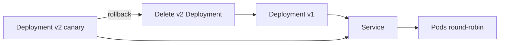

=========================================================================


## setup monitering to detect regressions or performance issues inn new model version once it is in the live cluster

I’d monitor the new model at both the **service and model-performance levels**. I’d track latency, error rates, throughput, CPU/memory, and prediction distributions using metrics and dashboards, while monitoring model-specific metrics such as accuracy, drift, feature distribution changes, and business KPIs. I’d compare these against the previous production version and define **alerts and rollback thresholds**. If significant regression or drift is detected, the deployment can automatically roll back to the previous stable model version.

### Where this is implemented

**Idea in this repo:** Prometheus counters/histograms on `/metrics`, CTR snapshots on `/monitoring/model-quality`, structured prediction logs, **offline** drift helpers. Dashboards, auto-rollback, and Jaeger are conceptual.

#### Directory

```text
recommendation-service/
├── app/
│   ├── metrics.py              # latency, errors, CTR counters
│   ├── model_quality.py        # impressions, clicks, CTR compare
│   ├── prediction_logger.py    # compact inference logs
│   ├── drift.py                # offline detect_drift / feature drift
│   ├── logging_config.py       # JSON logs
│   ├── middleware.py           # X-Request-ID
│   ├── tracing.py              # OpenTelemetry (console/none)
│   └── main.py                 # /metrics, /monitoring/model-quality, click hook
├── tests/
│   ├── test_observability.py
│   ├── test_model_monitoring.py
│   └── test_drift.py
└── implementation_Readme_3.md  # Tasks 21–22
```

#### Files and lines

| Concept | File | Lines | What it does |
| --- | --- | --- | --- |
| API latency / RPS | `app/metrics.py` | 7–17 | `recommendation_latency_seconds`, requests by source |
| Cache / PG errors | `app/metrics.py` | 19–39 | hits, misses, failures |
| Model latency / errors | `app/metrics.py` | 41–65 | per `model_version` |
| CTR counters | `app/metrics.py` | 67–77 | served + clicked |
| Record impressions | `app/model_quality.py` | 27–58 | `recommendations_served_total` + Redis last recs |
| Click attribution | `app/model_quality.py` | 61–99 | click in last list → clicked counter |
| CTR compare | `app/model_quality.py` | 102–120 | sort versions by CTR |
| Monitoring API | `app/main.py` | 188–223 | `GET /monitoring/model-quality` |
| Click hook | `app/main.py` | 235–241 | `POST /interactions` click → CTR |
| Serve-path metrics | `app/main.py` | 502–516 | observe latency; inc requests |
| Prediction log | `app/prediction_logger.py` | 23–66 | user, version, feature counts, recs |
| Called from model path | `app/recommendation_service.py` | 95–114 | log + impressions **after** predict |
| Drift (offline) | `app/drift.py` | 12–74 | never on request path |
| Drift baselines | `app/config.py` | 45–48 | `DRIFT_*` env |
| Prometheus scrape | `app/main.py` | 169–172 | `GET /metrics` |
| Tests | `tests/test_observability.py` | 139–221 | request id, metrics, cache hit |
| Tests | `tests/test_model_monitoring.py` | 72–154 | CTR + generate_recommendations logs |
| Tests | `tests/test_drift.py` | 7–52 | drift helpers |

#### Workflow (step by step)

1. Each recommendation request records latency and `source`/`model_version` (`main.py` finally block).
2. On a real model serve, `log_prediction` + impression counters run after `predict()`.
3. A later `click` on `POST /interactions` matches Redis `last_recs:{user_id}` and increments clicked for that version.
4. Operators scrape `/metrics` or call `/monitoring/model-quality` to compare v1 vs v2 CTR.
5. Batch jobs call `check_feature_drift()` with recent vs baseline averages — **not** inside `GET /recommendations`.
6. Canary rollback (manual in this repo): delete v2 Deployment if CTR/latency regress.

#### Workflow diagram

```text
Serve path                     Monitoring path
predict()                      /metrics  (Prometheus text)
   │                           /monitoring/model-quality (CTR)
   ├─ prediction log
   ├─ served counter
   └─ last_recs in Redis
          │
click event ─► match last_recs ─► clicked counter ─► CTR = clicks/served
          │
offline ─► drift.py vs baselines  (not on hot path)
```

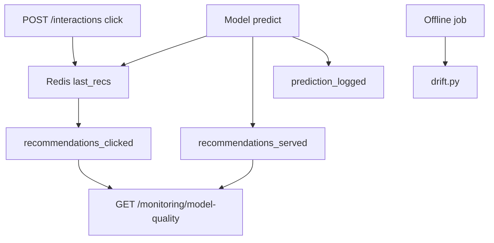

=======================================================================


## when designing an event driven pipeline using Kafka for both batch and analytics and online personalization, how would byou design the topics to maintain system decoupling?

I’d design Kafka around **domain events rather than consumers or processing use cases**, keeping producers independent from downstream services.

I’d have immutable, well-defined event topics such as user activity, transactions, and content interactions. Batch processing, analytics, and online personalization would consume these independently through their own **consumer groups**, so one workload doesn’t affect another.

For high-volume events, I’d partition by a stable key such as `user_id` to maintain ordering where required and distribute load. I’d use **schema versioning and a schema registry** to evolve event contracts without breaking consumers, and configure appropriate retention policies based on each topic’s purpose.

This gives us a decoupled architecture where new consumers can be added without changing the producers or existing pipelines.

### Where this is implemented

**Idea in this repo:** one **domain** topic `user-interactions` (not “for FastAPI” or “for analytics”). Producer keys by `user_id`. One consumer group materializes PG + Redis. A **DLQ** topic is separate. Extra groups for batch/analytics are conceptual (same topic, new `group_id`).

#### Directory

```text
recommendation-service/
├── app/
│   ├── events.py                 # domain event (not consumer-specific)
│   ├── kafka_producer.py         # publish to user-interactions
│   ├── kafka_consumer.py         # group recommendation-service
│   ├── config.py                 # topic, group, DLQ names
│   └── schema_registry.py        # contract independent of consumers
├── docker-compose.yml            # 3 partitions; kafka-init; scale consumers
└── tests/test_events.py
```

#### Files and lines

| Concept | File | Lines | What it does |
| --- | --- | --- | --- |
| Domain event | `app/events.py` | 10–16 | `user_id`, `item_id`, `event_type`, `timestamp`, optional `device_type` |
| Topic / group config | `app/config.py` | 25–27, 56–57 | `user-interactions`, group, `user-interactions-dlq` |
| Producer (no consumer knowledge) | `app/kafka_producer.py` | 112–138 | Avro + key=`user_id` |
| HTTP ingress | `app/main.py` | 226–254 | `POST /interactions` → publish only |
| Consumer group + subscribe | `app/kafka_consumer.py` | 109–137 | `group_id`, topic only |
| Partition rebalance logs | `app/kafka_consumer.py` | 29–41 | revoke/assign visibility |
| Process pipeline | `app/kafka_consumer.py` | 50–94 | PG then Redis — consumer’s job, not producer’s |
| Topic create 3 partitions | `docker-compose.yml` | 40–41, 54–78 | `user-interactions` + DLQ |
| Scale consumers | `docker-compose.yml` | 137–168 | `--scale kafka-consumer=3` comment |
| Schema independent of FastAPI | `app/schema_registry.py` | 53–73 | subject `user-interactions-value` |

**Conceptual:** separate consumer groups for analytics, training, and batch — add another process with a different `KAFKA_CONSUMER_GROUP`; do not add a new topic per use case.

#### Workflow (step by step)

1. API (or any producer) emits a `UserInteractionEvent` to **one** topic.
2. Kafka partitions by `user_id` so one user’s events stay ordered.
3. Consumer group members share partitions (rebalance when scaled).
4. This group writes `user_events` and Redis features. A future analytics group would read the same topic independently.
5. Poison durable writes go to `user-interactions-dlq`, not a “analytics topic”.

#### Workflow diagram

```text
Producers (FastAPI, future apps)
        │
        ▼
  topic: user-interactions   (domain events, 3 partitions, key=user_id)
        │
        ├── group recommendation-service  → PG + Redis features
        ├── group analytics      (*)      → warehouse
        ├── group training       (*)      → datasets
        └── DLQ topic                     → failed durable writes

(*) same topic, different group_id — not implemented as extra services
```

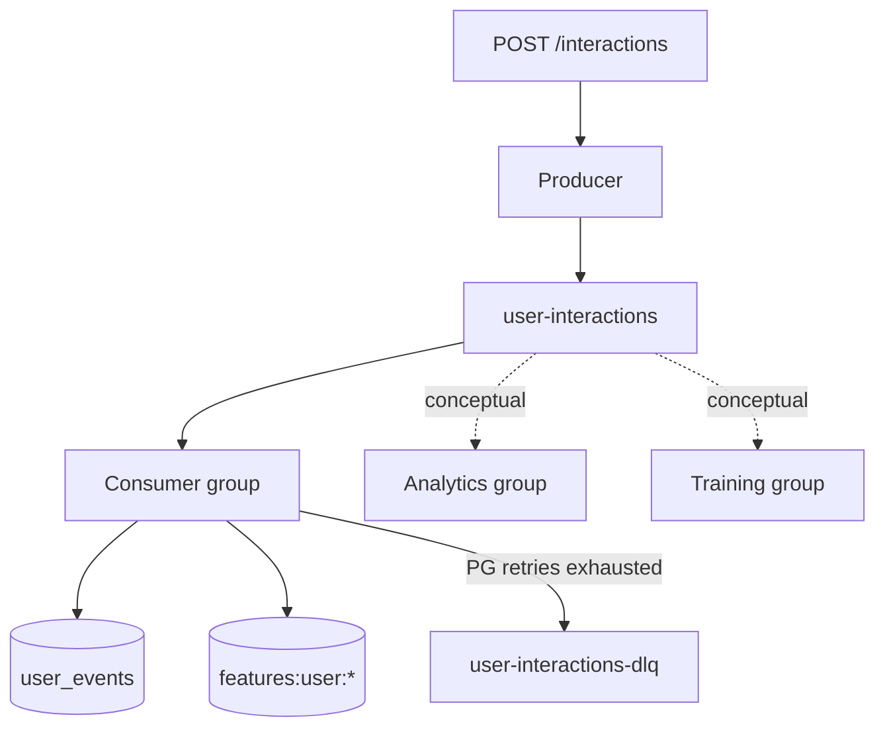

==========================================================================


## what approach would u take to ensure schema evolution does not break existing consumers, especially when adding anew fields to your kafka message structure?

I’d use a **schema registry with backward-compatible schema evolution**. When adding fields, I’d make them optional and provide sensible defaults so existing consumers can continue deserializing older messages without changes. I’d enforce compatibility checks in CI/CD before allowing a new schema to be deployed, and use explicit schema versioning so consumers can migrate independently.

This allows producers to evolve the event structure without breaking existing consumers.

### Where this is implemented

**Idea in this repo:** Avro + Apicurio Schema Registry. V2 adds optional `device_type` with default `null`. Compatibility is set to **FULL**. Consumers decode with a V2 reader schema so old V1 payloads still work.

#### Directory

```text
recommendation-service/
├── app/
│   ├── avro/
│   │   ├── user_interaction_v1.avsc   # 4 required fields
│   │   └── user_interaction.avsc      # + optional device_type
│   ├── events.py                      # Pydantic: device_type: str | None = None
│   ├── schema_registry.py             # register, FULL compat, encode/decode
│   ├── kafka_producer.py              # register V2, set_compatibility FULL
│   └── kafka_consumer.py              # reader_schema = V2 avsc
├── docker-compose.yml                 # Apicurio schema-registry
└── tests/test_events.py
```

#### Files and lines

| Concept | File | Lines | What it does |
| --- | --- | --- | --- |
| V1 schema (no new field) | `app/avro/user_interaction_v1.avsc` | 1–10 | user_id, item_id, event_type, timestamp |
| V2 optional field | `app/avro/user_interaction.avsc` | 10–14 | `device_type`: `["null","string"]`, `default: null` |
| Pydantic optional | `app/events.py` | 15–16 | `device_type: str \| None = None` |
| Register + FULL | `app/kafka_producer.py` | 22–45 | `register_schema` then `set_compatibility(..., "FULL")` |
| Encode with schema id | `app/schema_registry.py` | 63–90 | Confluent wire: magic + id + Avro |
| Decode writer + reader | `app/schema_registry.py` | 93–111 | `schemaless_reader(writer, reader)` |
| Consumer uses V2 reader | `app/kafka_consumer.py` | 101–102, 143–147 | `load_avro_schema("user_interaction.avsc")` |
| Registry URL | `app/config.py` | 29–31 | ccompat v7 + subject name |
| Apicurio service | `docker-compose.yml` | 81–100 | `schema-registry` healthcheck |
| Tests | `tests/test_events.py` | 23–30, 46–52 | optional field; Avro default null |

**CI does not call Schema Registry compatibility API** as a gate; FULL is set at producer startup. Adding required fields without defaults would break this pattern.

#### Workflow (step by step)

1. Keep V1 schema on disk for comparison (`user_interaction_v1.avsc`).
2. Add fields only as optional with Avro defaults (`device_type`).
3. Producer registers current schema; asks registry for FULL compatibility.
4. Messages carry schema id; consumer fetches writer schema by id and reads with V2 reader.
5. Old messages without `device_type` deserialize as `null`; new producers may set `"mobile"` / `"web"`.

#### Workflow diagram

```text
Pydantic UserInteractionEvent
        ↓
Avro V2 (device_type optional, default null)
        ↓
Schema Registry  (FULL compatibility)
        ↓
Kafka  (magic + schema_id + payload)
        ↓
Consumer reader schema V2  →  device_type or null
```

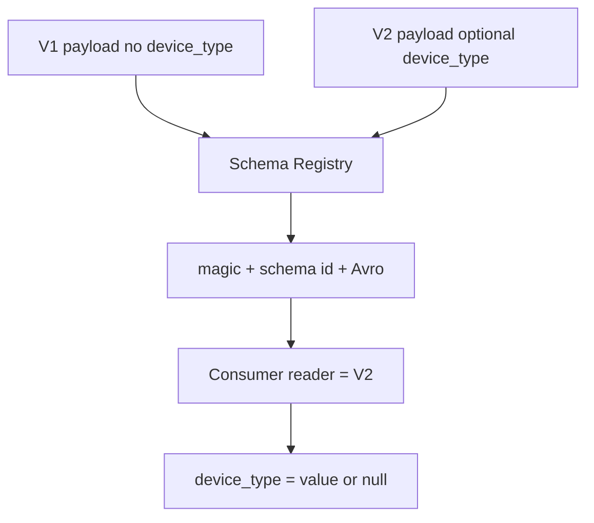

==========================================================================


## when guiding a mid-level engineer implementing a genai api, what one key principle you would emphasize to maintain code quality thourghout the development process?

I’d emphasize **separation of concerns with clear, testable interfaces**. Keep GenAI-specific logic—prompt construction, model calls, response parsing, validation, retries, and error handling—isolated from business logic. Then enforce this through unit tests, type/schema validation, code reviews, and consistent error handling throughout development.

This makes the API easier to test, maintain, and safely evolve as models and prompts change.

### Where this is implemented

**Idea in this repo (same principle, recommendation not GenAI):** keep ranking isolated from HTTP, SQL, and Redis. The model only ranks; the service layer fetches features/candidates; FastAPI only routes. Tests hit `predict()` and fakes without Kafka.

#### Directory

```text
recommendation-service/
├── app/
│   ├── main.py                      # HTTP only — no SQL in handlers beyond wiring
│   ├── recommendation_service.py    # orchestration (features + candidates + model)
│   ├── model.py                     # ranking only — no I/O
│   ├── model_registry.py
│   ├── schemas.py / features.py     # typed I/O
│   ├── recommendation_repository.py
│   └── feature_store.py
└── tests/
    ├── test_model.py                # model without FastAPI
    └── test_recommendations.py      # FakeRedis / FakePool
```

#### Files and lines

| Concept | File | Lines | What it does |
| --- | --- | --- | --- |
| API vs logic | `app/main.py` | 310–320, 383–387 | Calls `generate_recommendations`, does not rank |
| Orchestration docstring | `app/recommendation_service.py` | 38–44 | “without putting SQL or Redis details in the model” |
| Model has no I/O | `app/model.py` | 7–18, 24–31, 37–60 | `predict` on in-memory objects only |
| Typed request/response | `app/schemas.py` | 6–18 | Pydantic validation at the edge |
| Feature schema | `app/features.py` | 4–13 | Model input contract |
| Candidate type | `app/recommendation_repository.py` | 13–15, 31–50 | DB mapping stays in repository |
| Unit tests without stack | `tests/test_model.py` | 20–45 | Direct `get_model().predict(...)` |
| API tests with fakes | `tests/test_recommendations.py` | 37–80, 115–133 | FakeRedis / FakeConnection |

#### Workflow (step by step)

1. HTTP layer validates path/body (`Path`, Pydantic).
2. Service layer loads features and candidates (I/O).
3. Model ranks only those structures.
4. Tests: model tests skip Redis/Postgres; API tests inject fakes.

#### Workflow diagram

```text
FastAPI routes          ← HTTP, status codes
        ↓
recommendation_service  ← I/O orchestration
        ↓
model.predict           ← pure ranking
        ↑
Pydantic schemas        ← validation at boundaries
```

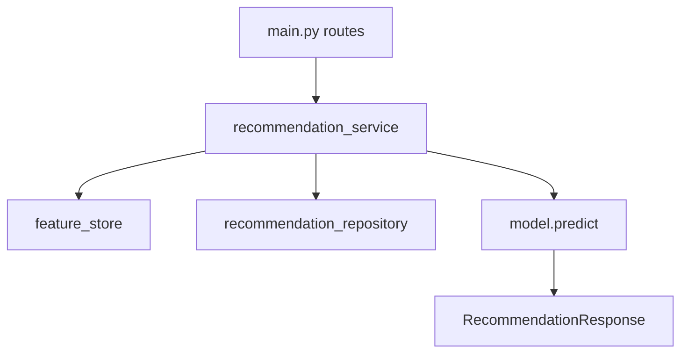

=========================================================================


## how woul d ytiu advuse that engineer ti cimmunicate trade-offs with oridyct when there is pressure to deliver quickly but quality risks are involved

I’d advise them to **communicate trade-offs in terms of business impact, not just technical concerns**. Clearly explain what can be delivered quickly, what quality risks it introduces, and the potential impact on reliability, security, or future development. Then propose a pragmatic compromise—such as reducing scope while keeping critical quality standards—and agree with Product on the decision and its follow-up plan.

The goal is to make the trade-off **explicit and shared**, rather than silently sacrificing quality.

### Where this is implemented

**This answer is process, not a runtime feature.** The repo still records the same kind of trade-off: what shipped vs what stayed conceptual, and where quality was kept on the hot path (no drift in request, popular fallback instead of 500).

#### Directory

```text
recommendation-service/
├── system_architecture.md          # Implemented vs conceptual table
├── Goal.md                         # one-task-at-a-time; don’t dump everything
├── implementation_Readme.md        # Tasks 1–8
├── implementation_Readme_2.md      # Tasks 9–16
├── implementation_Readme_3.md      # Tasks 17–22
├── implementation_Readme_4.md      # 23–24 + resilience
└── app/drift.py                    # explicit: NOT on request path
```

#### Files and lines

| Concept | File | Lines | What it does |
| --- | --- | --- | --- |
| Honest scope | `system_architecture.md` | 19–46 | Implemented vs Ingress/Grafana/multi-group |
| Don’t hide quality cuts | `app/drift.py` | 1–4, 48–57 | Drift is offline; comment explains latency cost |
| Degrade UX not errors | `app/main.py` | 319–320, 491–501 | Contract: still return recommendations |
| Incremental delivery | `Goal.md` | 28–43 | One task; don’t dump the whole system |
| Canary vs HPA trade-off | `implementation_Readme_4.md` | 213–234 | Don’t run v1+v2 during HPA (mixed metrics) |

#### Workflow (step by step)

1. State what ships now vs later (`system_architecture.md` table).
2. Name the risk (e.g. drift on the request path adds latency) and keep the quality bar (`drift.py` offline).
3. Agree a compromise (popular fallback vs outage; canary file exists but deleted before load test).
4. Write it in the implementation readme so Product/engineering share the decision.

#### Workflow diagram

```text
Pressure to ship
        ↓
List: fast path vs quality risk vs user impact
        ↓
Shared decision (scope cut, not silent 500s / skipped tests)
        ↓
Document in architecture + task readme
```

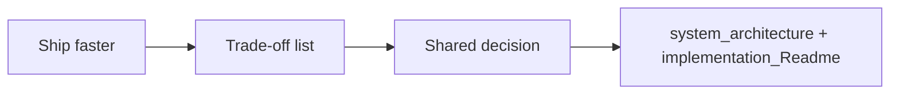

=========================================================================


## how would you guide that engineer to incorporate effective ci/cd practice to ensure smooth delivery of the genai api?

I’d establish a **gated CI/CD pipeline** that automatically runs linting, type checks, unit/integration tests, security scans, and API/schema validation before deployment. Build an immutable Docker image and deploy it through environments such as staging and production using infrastructure-as-code.

For the GenAI layer specifically, I’d also include **automated evaluation tests for prompts and model outputs**, track model/prompt versions, and use canary or blue-green deployments with monitoring and rollback. This gives the engineer fast feedback while preventing untested changes from reaching production.

### Where this is implemented

**Idea in this repo:** GitHub Actions runs pytest and `docker build` on push/PR. Images are immutable tags (`recommendation-service:v1` / `:v2`). Canary Deployments exist. Full CD (staging env, IaC apply, prompt eval suite) is conceptual.

#### Directory

```text
recommendation-service/
├── .github/workflows/ci.yml     # pytest + docker build
├── Dockerfile
├── requirements.txt
├── tests/                       # unit/integration with fakes
├── k8s/                         # deploy manifests (applied manually)
└── tests/test_health_version.py # version identity for canary
```

#### Files and lines

| Concept | File | Lines | What it does |
| --- | --- | --- | --- |
| CI triggers | `.github/workflows/ci.yml` | 3–13 | push main/master/develop; PRs |
| Test job | `.github/workflows/ci.yml` | 16–35 | Python 3.12, `pip install -r`, `pytest` |
| Image build gate | `.github/workflows/ci.yml` | 37–39 | `docker build -t recommendation-service:test` |
| Immutable image | `Dockerfile` | 1–13 | deps then app copy; uvicorn CMD |
| Canary deploy | `k8s/deployment.yaml` / `deployment-v2.yaml` | full files | v1 vs v2 images + `SERVICE_VERSION` |
| Model/prompt analog | `app/model_registry.py` | 7–17 | versioned artifact selected by env |
| Tests as gate | `tests/*.py` | all | 13 test modules covering API, Kafka schema, resilience |

#### Workflow (step by step)

1. Push or open PR → Actions checks out code.
2. Install `requirements.txt`, run `pytest` (fails the gate on regressions).
3. `docker build` proves the image still packs.
4. Deploy is **manual** here: build `:v1`/`:v2`, `kubectl apply`. Rollback = delete v2.

#### Workflow diagram

```text
git push / PR
     ↓
pytest  →  docker build
     ↓
(manual) docker tag v1/v2 → kubectl apply
     ↓
canary validate /health version → promote or delete v2
```

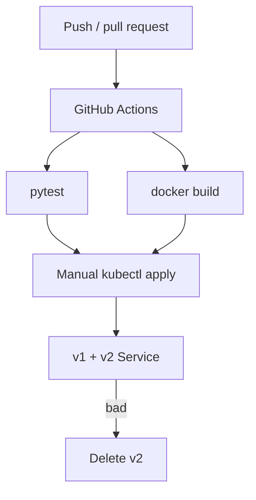

=========================================================================


## how would you help them to keep delivery ontrack when unexpected delays occur in testing or integration phases

I’d help them **identify blockers early, communicate impact immediately, and re-plan around them**. Separate critical-path work from non-blocking tasks, prioritize the issues preventing integration, and use mocks or stubs where possible so development can continue in parallel. If a delay threatens the deadline, I’d work with Product to reduce scope or adjust priorities rather than compromising critical quality checks.

The key is to **maintain momentum through parallel work while keeping stakeholders informed about schedule and trade-offs**.

### Where this is implemented

**This answer is delivery process.** The repo supports it with **mocks/stubs** so tests and API work without Redis/Postgres/Kafka, and a **task-at-a-time** tutorial so integration delays don’t block the next learning slice.

#### Directory

```text
recommendation-service/
├── Goal.md                         # one task; wait for “done”
├── tests/test_recommendations.py   # FakeRedis, FakePool, FakeConnection
├── tests/test_observability.py     # same fakes
├── tests/test_resilience.py        # monkeypatch DLQ / PG save
├── tests/test_health_version.py    # noop init_db / producer
├── app/main.py                     # lifespan continues if PG/Kafka down
└── Manual_Testing_Readme.md        # how to verify when stack is up
```

#### Files and lines

| Concept | File | Lines | What it does |
| --- | --- | --- | --- |
| Parallel via mocks | `tests/test_recommendations.py` | 37–80 | In-memory Redis/PG; no Docker required |
| Lifespan isolation | `tests/test_health_version.py` | 18–28 | Stub `init_db` / Kafka so `/health` tests run |
| Consumer without broker | `tests/test_resilience.py` | 120–139 | Fake `_save_event_durable` + fake DLQ |
| Soft dependencies | `app/main.py` | 62–74 | PG/Kafka start failure → log, still serve |
| One-task plan | `Goal.md` | 28–43 | Don’t block on the whole pipeline |
| Manual integration | `Manual_Testing_Readme.md` | (whole file) | When Compose is available |

#### Workflow (step by step)

1. If Kafka/Postgres integration is blocked, keep shipping behind fakes (`pytest` still runs).
2. Keep the API useful without those deps (popular fallback + soft lifespan).
3. Unblock the critical path when brokers are up (`docker compose up`, Manual testing readme).
4. Tell stakeholders: unit path is green; integration waits on X — rather than freezing all work.

#### Workflow diagram

```text
Integration delay (Kafka/PG)
        ├── continue: pytest + fakes
        ├── continue: API + popular fallback
        └── blocked: live consumer / Schema Registry
                    ↓
            compose up when ready
```

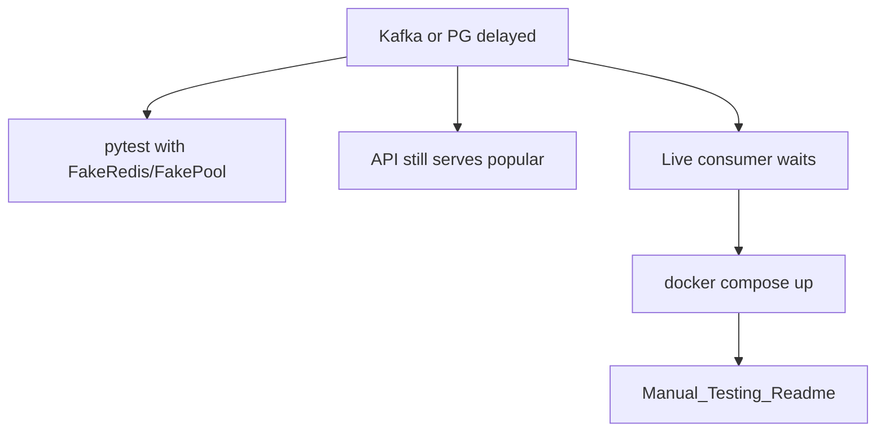

=========================================================================


## Now, give me basic simple and easy to understand step by step plan to implement the concepts what we have used. Is there any resource covering these or tutorial or anything. one task at a time

Readme.md has tasks with description

Implementation_Readme.md has the details of those Implementations

### Where this is implemented

The **plan is the tutorial chain**. Tasks 1–8 in part 1, 9–16 in part 2, 17–22 in part 3, 23–25 + resilience in part 4. `Readme.md` is the task list; implementation files are the how-to; chats capture what we actually ran into.

#### Directory

```text
recommendation-service/
├── Goal.md
├── Readme.md                      # task list + descriptions
├── implementation_Readme.md       # Tasks 1–8
├── implementation_Readme_2.md     # Tasks 9–16
├── implementation_Readme_3.md     # Tasks 17–22
├── implementation_Readme_4.md     # Tasks 23–25 + resilience
├── system_architecture.md         # final picture
├── Manual_Testing_Readme.md
├── Feature_Store.md / Kafka.md
├── cursor_chats/
│   ├── Task1_to_Task15_...
│   ├── Task16_to_19_...
│   └── Task20_to_end_...
├── app/                           # the running service
├── tests/
├── k8s/
└── .github/workflows/ci.yml
```

#### Files and lines (where to start)

| Task range | File | What to read |
| --- | --- | --- |
| Why / rules | `Goal.md` | 1–43 one task at a time |
| Task list | `Readme.md` | high-level “do this then that” |
| 1–8 API, Redis, fallback, health | `implementation_Readme.md` | overview table lines 12–23 |
| 9–16 config, K8s, PG, Kafka | `implementation_Readme_2.md` | overview table lines 12–21 |
| 17–22 schema, features, model, CI, obs, monitoring | `implementation_Readme_3.md` | overview table lines 14–21 |
| 23–25 canary, HPA, architecture, resilience | `implementation_Readme_4.md` | overview table lines 14–19 |
| Accuracy vs code | `system_architecture.md` | 19–46 implemented vs conceptual |
| Session history | `cursor_chats/` | debugging Compose, Redis, Kafka, K8s |

#### Workflow (step by step)

1. Read `Goal.md` — one task, then “done”.
2. Pick the next task in `Readme.md`.
3. Follow the matching `implementation_Readme_*.md` section (goal, files touched, how to run).
4. Change only the listed files; run the tests named there.
5. After Task 25, use `system_architecture.md` as the map of sync vs async paths.

#### Workflow diagram

```text
Goal.md (how to learn)
    ↓
Readme.md (what task)
    ↓
implementation_Readme.md        Tasks 1–8
implementation_Readme_2.md      Tasks 9–16
implementation_Readme_3.md      Tasks 17–22
implementation_Readme_4.md      Tasks 23–25
    ↓
app/ + tests/ + k8s/
    ↓
system_architecture.md
```

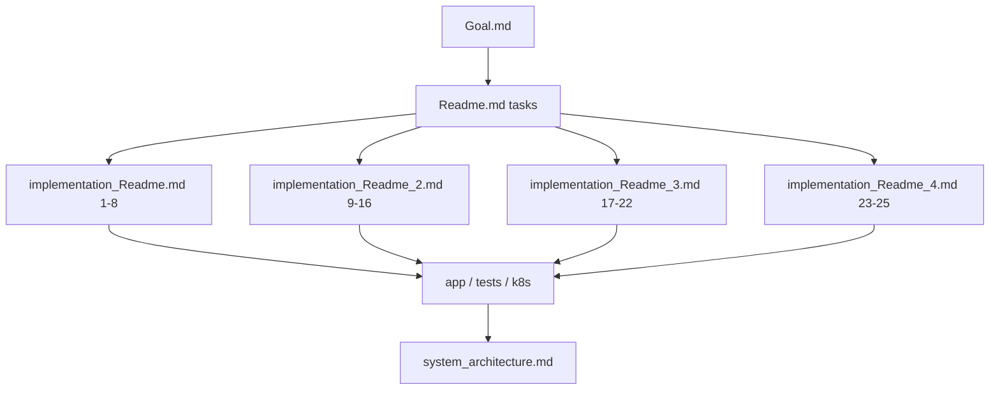


============================================


I analyzed `Interview_Answers_Readme.md` against `app/`, `k8s/`, tests, `cursor_chats/`, and `implementation_Readme.md` through `_4.md`. After **each of the 13 answers** I added an implementation map: files + line numbers, a scoped directory tree, a step-by-step workflow, and ASCII + mermaid diagrams.

Open [Interview_Answers_Readme.md](c:\Projects\recommendation-service\Interview_Answers_Readme.md) — original answers are unchanged; each is followed by **Where this is implemented**.

**What maps to what**

| Interview topic | Main implementation |
| --- | --- |
| Scale + low latency | Thin `GET /recommendations` in `app/main.py` (cache → model → store → popular); Kafka/features offline; K8s HPA |
| Cache / feature-store faults | Circuit breaker `app/resilience.py`; Redis timeouts; `/ready` does not require Redis |
| Both cache and store down | `POPULAR_RECOMMENDATIONS` in `app/recommendation_store.py`; `main.py` 491–501 |
| Notebook → K8s | `app/model.py` contract, `Dockerfile`, `k8s/deployment.yaml` probes |
| Versioning | ML: `model_registry.py`; deploy: `SERVICE_VERSION` + `k8s/deployment-v2.yaml` |
| Live-model monitoring | `/metrics`, `/monitoring/model-quality`, `drift.py` (offline only) |
| Kafka decoupling | Domain topic `user-interactions`, key=`user_id`; extra consumer groups are conceptual |
| Schema evolution | Avro V2 optional `device_type`, Schema Registry `FULL` |
| Code quality (GenAI analog) | Model has no I/O; `recommendation_service.py` orchestrates |
| Product trade-offs | Documented in `system_architecture.md` implemented vs conceptual |
| CI/CD | `.github/workflows/ci.yml` pytest + image build; CD is manual kubectl |
| Integration delays | Tests with FakeRedis/FakePool; API still serves if PG/Kafka are down |
| One-task plan | `Readme.md` + `implementation_Readme.md` … `_4.md` |

Billion-user extras (CDN, sharding, multi-group analytics, auto-rollback dashboards) are marked **conceptual** so the file does not claim the repo does more than it does.